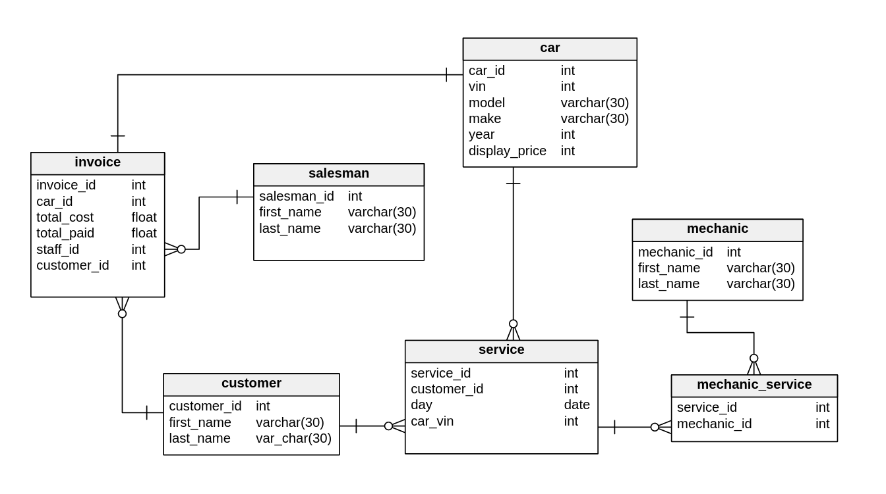

## Coding Temple Week 5 Day 5 Homework
###### CT-week5-day5-homework

Each car holds it's car info   
Each customer, salesman, and mechanic holds it's person info   
Each invoice holds a reference to the car being sold, the salesman selling it, and the customer buying it along with the payments so far   
Each service holds references to the car being serviced, customer needing the service, and the join table connecting that service to the one or many mechanics that worked on it   

#### Diagram
